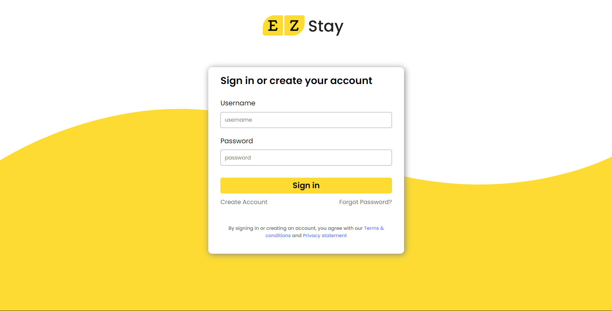
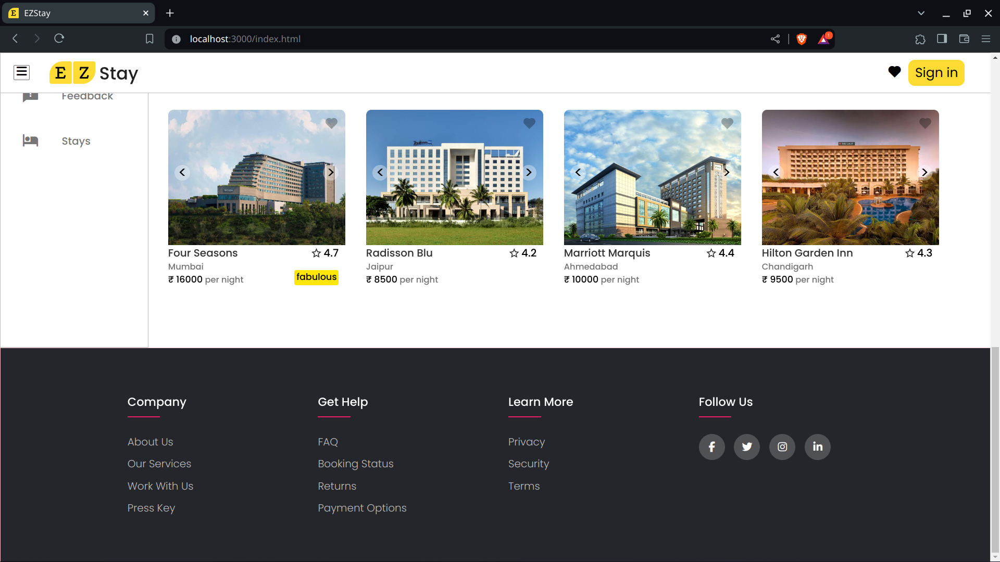
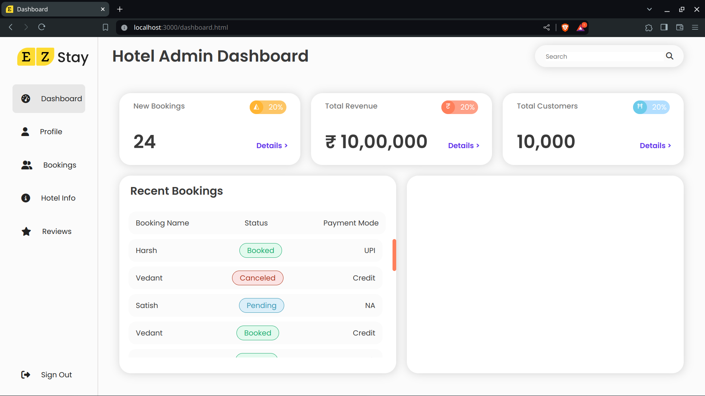
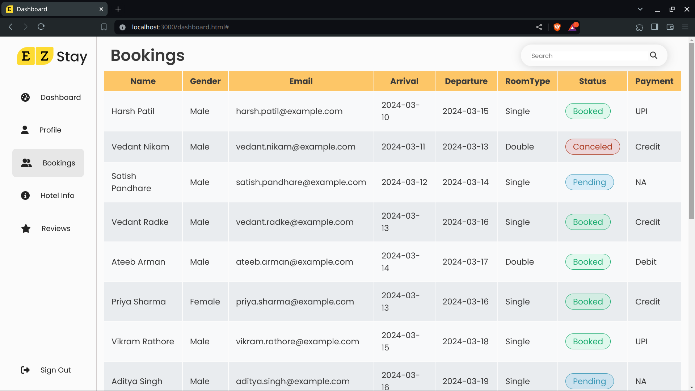
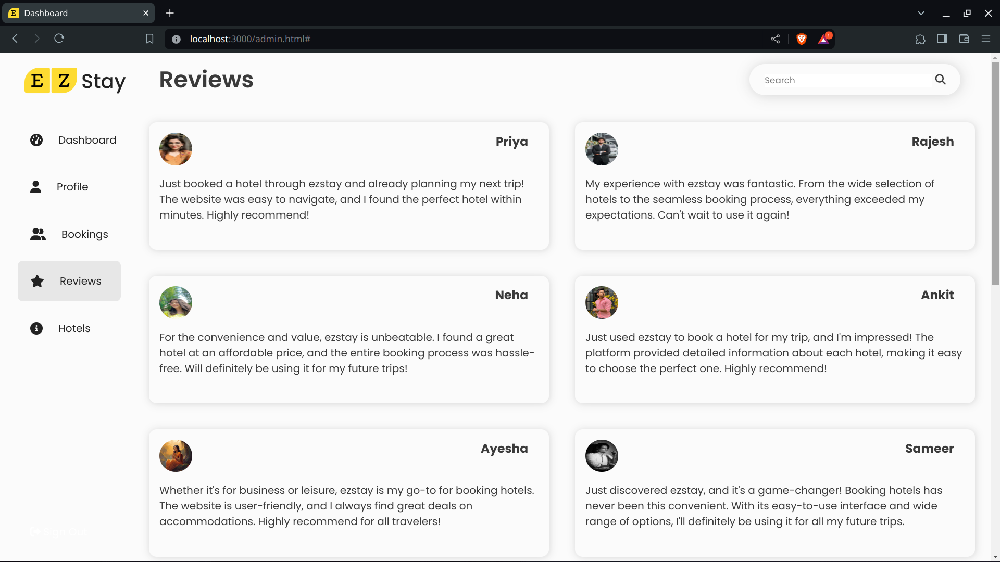
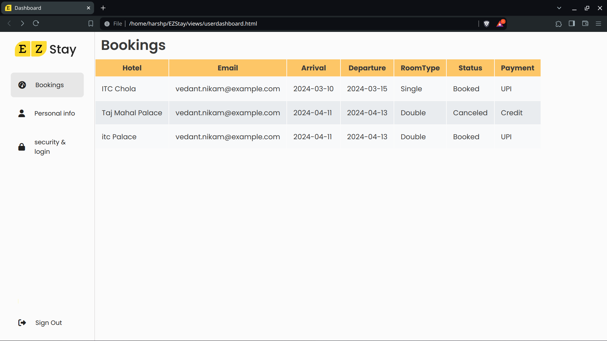

# EZStay

> Online Hotel Booking Platform
> Group 35

# 💻 Tech Stack:


     

<!-- Proudly created with GPRM ( https://gprm.itsvg.in ) -->

## Run Locally

1.Clone the repository using git

```
git clone https://github.com/harsh-m-patil/EZStay.git
```

2.Go to the EZStay directory

```
cd EZStay
```

3.Install Dependencies

```
npm install
# this packages will be installed cookie-parser express express-session mongodb mongoose nodemon
```

4.Run the server

```
npm start
```

the server will run on localhost:3000

## Screenshots

### Login Page



### Home Page




### Business Page


### Dashboards

**Hotel Admin**  



**Admin**  



**User**  

